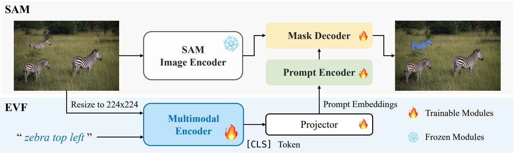
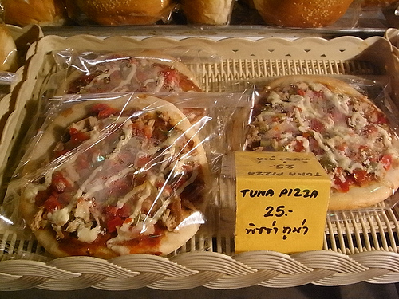
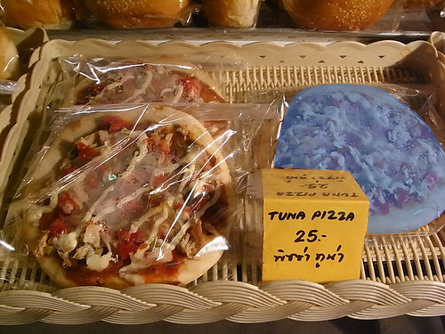
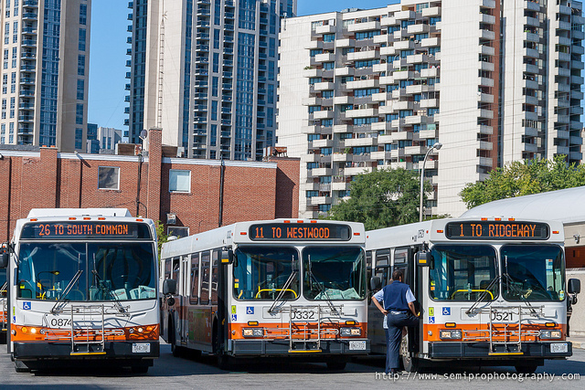

<div align ="center">
<h1> 📷EVF-SAM </h1>
<h3> Early Vision-Language Fusion for Text-Prompted Segment Anything Model </h3>

[Yuxuan Zhang](https://github.com/CoderZhangYx)<sup>1</sup> \*, [Tianheng Cheng](https://xwcv.github.io)<sup>1</sup> \*, Lei Liu<sup>2</sup>, Heng Liu<sup>2</sup>, Longjin Ran<sup>2</sup>, Xiaoxin Chen<sup>2</sup>, [Wenyu Liu](http://eic.hust.edu.cn/professor/liuwenyu)<sup>1</sup>, [Xinggang Wang](https://xwcv.github.io/)<sup>1 📧</sup>

<sup>1</sup> Huazhong University of Science and Technology, <sup>2</sup> vivo AI Lab

(\* equal contribution, 📧 corresponding author)


**(TODO)**
[Arxiv](https://arxiv.org/abs/2406.20076) [🤗Huggingface](https://huggingface.co/YxZhang/evf-sam) [🤗Demo]
</div>


## Highlight
<div align ="center">

</div>

* EVF-SAM extends SAM's capabilities with text-prompted segmentation, achieving high accuracy in Referring Expression Segmentation.  
* EVF-SAM is designed for efficient computation, enabling rapid inference in few seconds per image on a T4 GPU.


## Updates
- [x] Release code
- [ ] Release weights
- [ ] Release demo


## Visualization 
<table class="center">
<tr>
  <td style="text-align:center;"><b>Input text</b></td>
  <td style="text-align:center;"><b>Input image</b></td>
  <td style="text-align:center;"><b>Output</b></td>
</tr>
<tr>
  <td width=20% style="text-align:center;"><b>"zebra top left"</b></td>
  <td></td>
  <td></td>
</tr> 

<tr>
  <td width=20% style="text-align:center;"><b>"a pizza with a yellow sign on top of it"</b></td>
  <td></td>
  <td></td>
</tr> 

<tr>
  <td width=20% style="text-align:center;"><b>"the broccoli closest to the ketchup bottle"</b></td>
  <td></td>
  <td></td>
</tr> 

<tr>
  <td width=20% style="text-align:center;"><b>"bus going to south common"</b></td>
  <td></td>
  <td></td>
</tr> 

<tr>
  <td width=20% style="text-align:center;"><b>"3carrots in center with ice and greenn leaves"</b></td>
  <td></td>
  <td></td>
</tr> 

</table>


## Installation
1. clone this repository  
2. install pytorch for your cuda version  
3. pip install -r requirements.txt


## Weights
<table class="center">
<tr>
  <td style="text-align:center;"><b>Name</b></td>
  <td style="text-align:center;"><b>SAM</b></td>
  <td style="text-align:center;"><b>BEIT-3</b></td>
  <td style="text-align:center;"><b>Params</b></td>
  <td style="text-align:center;"><b>Reference Score</b></td>
</tr>

<tr>
  <td style="text-align:center;"><b>[evf-sam](https://huggingface.co/YxZhang/evf-sam)</b></td>
  <td style="text-align:center;"><b>SAM-H</b></td>
  <td style="text-align:center;"><b>BEIT-3-L</b></td>
  <td style="text-align:center;"><b>1.32B</b></td>
  <td style="text-align:center;"><b>83.7</b></td>
</tr>

<!-- <tr>
  <td style="text-align:center;"><b> evf-sam-fix </b></td>
  <td style="text-align:center;"><b>SAM-H</b></td>
  <td style="text-align:center;"><b>BEIT-3-L</b></td>
  <td style="text-align:center;"><b>1.32B</b></td>
  <td style="text-align:center;"><b>82.9</b></td>
</tr> -->

<tr>
  <td style="text-align:center;"><b> evf-effi-sam-L </b></td>
  <td style="text-align:center;"><b>EfficientSAM-S</b></td>
  <td style="text-align:center;"><b>BEIT-3-L</b></td>
  <td style="text-align:center;"><b>700M</b></td>
  <td style="text-align:center;"><b>83.5</b></td>
</tr>

<tr>
  <td style="text-align:center;"><b> evf-effi-sam-B </b></td>
  <td style="text-align:center;"><b>EfficientSAM-T</b></td>
  <td style="text-align:center;"><b>BEIT-3-B</b></td>
  <td style="text-align:center;"><b>232M</b></td>
  <td style="text-align:center;"><b>80.0</b></td>
</tr>
</table>

<!-- evf-sam-fix keeps all SAM's parameters frozen during training, keeping all SAM's original capabilities. -->


## Inference
```
python inference.py  \
  --version <path to evf-sam> \
  --precision='fp16' \
  --vis_save_path "<path to your output direction>" \
  --model_type <"ori" or "effi", depending on your loaded ckpt>   \
  --image_path <path to your input image> \
  --prompt <customized text prompt>
```
*--load_in_8bit* and *--load_in_4bit* is **optional**  
for example: 
```
python inference.py  \
  --version evf-sam-21 \
  --precision='fp16' \
  --vis_save_path "infer" \
  --model_type ori   \
  --image_path "assets/zebra.jpg" \
  --prompt "zebra top left"
```

## Demo
```
python demo.py <path to evf-sam>
```

## Data preparation
Referring segmentation datasets: [refCOCO](https://web.archive.org/web/20220413011718/https://bvisionweb1.cs.unc.edu/licheng/referit/data/refcoco.zip), [refCOCO+](https://web.archive.org/web/20220413011656/https://bvisionweb1.cs.unc.edu/licheng/referit/data/refcoco+.zip), [refCOCOg](https://web.archive.org/web/20220413012904/https://bvisionweb1.cs.unc.edu/licheng/referit/data/refcocog.zip), [refCLEF](https://web.archive.org/web/20220413011817/https://bvisionweb1.cs.unc.edu/licheng/referit/data/refclef.zip) ([saiapr_tc-12](https://web.archive.org/web/20220515000000/http://bvisionweb1.cs.unc.edu/licheng/referit/data/images/saiapr_tc-12.zip)) and [COCO2014train](http://images.cocodataset.org/zips/train2014.zip)  
```
├── dataset
│   ├── refer_seg
│   │   ├── images
│   │   |   ├── saiapr_tc-12 
│   │   |   └── mscoco
│   │   |       └── images
│   │   |           └── train2014
│   │   ├── refclef
│   │   ├── refcoco
│   │   ├── refcoco+
│   │   └── refcocog


## Evaluation
```
torchrun --standalone --nproc_per_node <num_gpus> eval.py   \
    --version <path to evf-sam> \
    --dataset_dir <path to your data root>   \
    --val_dataset "refcoco|unc|val"
```

## Acknowledgement
We borrow some codes from [LISA](https://github.com/dvlab-research/LISA/tree/main), [unilm](https://github.com/microsoft/unilm), [SAM](https://github.com/facebookresearch/segment-anything), [EfficientSAM](https://github.com/yformer/EfficientSAM).

## Citation
TODO